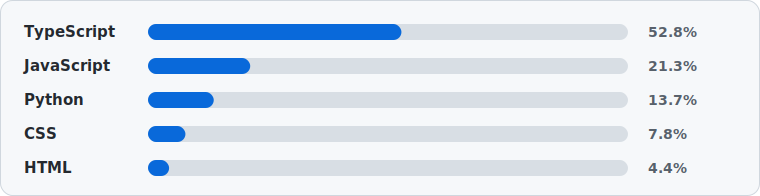

#  Hey there! I'm Mohammad Al-Baker Zaytoun

<div align="center">
  
</div>

<div align="center">
  
  [](https://git.io/typing-svg)
  
</div>

<div align="center">
  <a href="https://zaytoun-portfolio.vercel.app">
    
  </a>
  <a href="https://www.linkedin.com/in/mohammad-al-baker-zaytoun-337625135">
    
  </a>
  <a href="https://zaytounsolutions.com">
    
  </a>
  <a href="mailto:mabzaytoun@gmail.com">
    
  </a>
  <a href="https://github.com/Mohammad-AlBaker-Zaytoun">
    
  </a>
</div>

<br/>

<div align="center">
  
</div>

---

##  **About Me** 


```typescript
class SeniorSoftwareEngineer {
  name: string = "Mohammad Al-Baker Zaytoun";
  location: string = "Beirut, Lebanon 🇱🇧";
  company: string = "Zaytoun Solutions";
  
  languages: string[] = ["JavaScript", "TypeScript", "Python", "SQL", "Java", "PHP", "NoSQL"];
  
  currentlyLearning: string[] = [
    "Advanced AWS Architecture",
    "Microservices Patterns",
    "Web3 Technologies"
  ];
  
  getDailyRoutine(): string[] {
    return [
      "☕ Coffee.brew()",
      "💻 Code.write()",
      "🐛 Bugs.fix()",
      "🚀 Features.deploy()",
      "🔄 Repeat()"
    ];
  }
  
  getFunFact(): string {
    return "I can debug code faster than I can explain what it does! 🎯";
  }
}
```

<br clear="both">

##  **Tech Arsenal**

<div align="center">

### 🎨 **Frontend Magic**
<div>
  
</div>

### ⚙️ **Backend Power**
<div>
  
</div>

### 🗄️ **Database & Cloud**
<div>
  
</div>

### 🛠️ **Tools & More**
<div>
  
</div>

</div>

<br/>

##  **Coding Activity**

<div align="center">
  
  [](https://github.com/ashutosh00710/github-readme-activity-graph)
  
</div>

## 📊 **GitHub Stats Dashboard**

<div align="center">
   
  
</div>

<div align="center">
  
  [](https://git.io/streak-stats)
  
</div>

## 🏆 **GitHub Trophies**

<div align="center">
  
  [](https://github.com/ryo-ma/github-profile-trophy)
  
</div>

## 🚀 **Featured Projects**

<div align="center">
  <a href="https://github.com/Mohammad-AlBaker-Zaytoun/Next-Portfolio">
    
  </a>
  <a href="https://github.com/Mohammad-AlBaker-Zaytoun/vscode-portfolio">
    
  </a>
</div>

<div align="center">
  <a href="https://github.com/Mohammad-AlBaker-Zaytoun/HLR-Lookups-TMT">
    
  </a>
  <a href="https://github.com/Mohammad-AlBaker-Zaytoun/Prayers-API">
    
  </a>
</div>

## 💻 **Weekly Development Breakdown**

<div align="center">
  
</div>

## 🎯 **Current Focus**

<div align="center">
  <table>
    <tr>
      <td align="center" width="50%">
        
        <br><b>🔨 Building</b><br>
        Scalable microservices with Next.js 15
      </td>
      <td align="center" width="50%">
        
        <br><b>📚 Learning</b><br>
        Advanced AWS Architecture & DevOps
      </td>
    </tr>
    <tr>
      <td align="center" width="50%">
        
        <br><b>🔍 Exploring</b><br>
        AI Integration in Web Apps
      </td>
      <td align="center" width="50%">
        
        <br><b>🤝 Contributing</b><br>
        Open Source Projects
      </td>
    </tr>
  </table>
</div>

## 🎮 **Fun Zone**

<div align="center">
  
### 🐍 **My Contribution Snake**
  
[](https://github.com/Mohammad-AlBaker-Zaytoun)

### 💭 **Random Dev Quote**

[](https://github.com/piyushsuthar/github-readme-quotes)

### 😂 **Joke Break**


</div>

## 🤝 **Let's Connect & Build Something Amazing!**

<div align="center">
  
  
  <h3>💬 Reach out to me for collaborations, freelance work, or just a tech chat!</h3>
  
  <a href="https://github.com/Mohammad-AlBaker-Zaytoun">
    
  </a>
  <a href="https://www.linkedin.com/in/mohammad-al-baker-zaytoun-337625135">
    
  </a>
  <a href="mailto:mabzaytoun@gmail.com">
    
  </a>
  <a href="https://zaytoun-portfolio.vercel.app">
    
  </a>
  <a href="https://zaytounsolutions.com">
    
  </a>
</div>

---

<div align="center">
  
  
  [](https://github.com/Mohammad-AlBaker-Zaytoun)
  
  <br/>
  
  **⚡ "Code is not just my profession, it's my passion and my art!" ⚡**
  
  
</div>